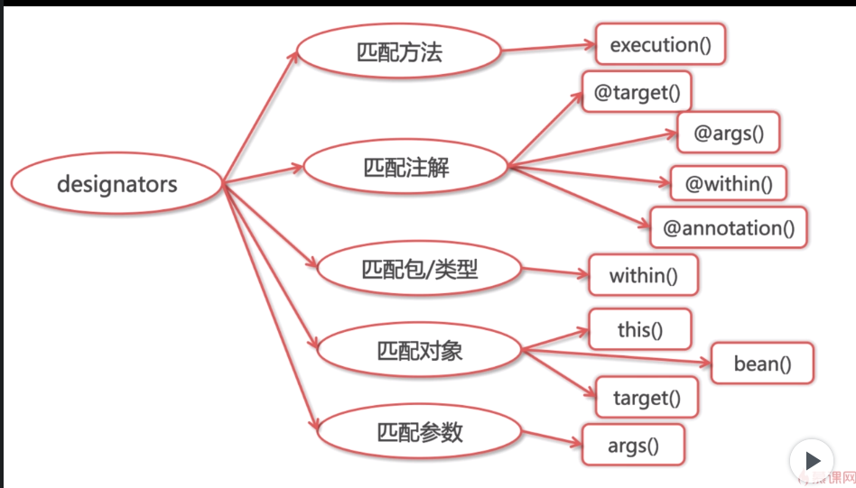

### 关于面向切面编程
- 理解
    - 切面分离，功能性需求与非功能性需求，剥离出俩，集中管理
    - 对于oop的补充。
    - 应用的场景： 权限控制，缓存控制，事务控制，日志，性能控制
    - 代码入侵，一个类只进行一个操作。逻辑分离。(侵入性更加少)

- 使用方式
    - xml  or  注解
    - 注解
        - 五种表达方式，@Aspect， @pointcut， advice
        - 切面表达式 
        - 可以通过多种方式去匹配类或是注解方式去实现，within， target annotation  args  。。
        - within retentionpolicy . runtime class   elementype method
        - aspect 编译时期  aspetj 5+ 类加载时期，
        - spring   aop  运行时，由运行空间去实现，运行时植入
        - 基于代理去实现 静态代理，以及动态代理。  运用到了。
        -

    - 代理aop,接口的代理，继承。 ===> jdk 代理， cglib代理